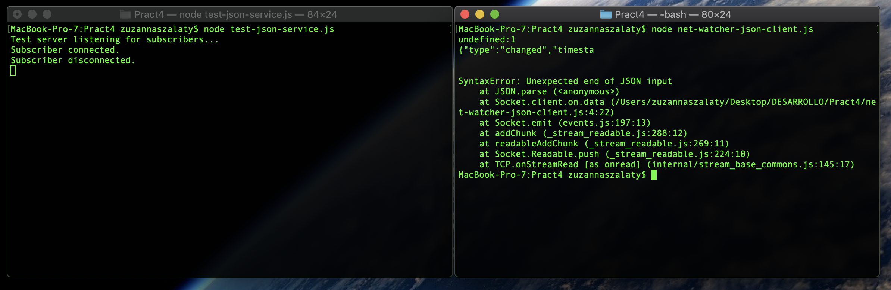

# Práctica 4
# Escucha de conexiones de sockets
Los servicios de red existen para conectar y transmitir información. Siempre se debe hacer una conexión primero.

## Enlace de un servidor a un puerto TCP
Las conexiones de socket TCP constan de dos puntos finales. Un punto extremo se enlaza a un puerto numerado, mientras que el otro punto extremo se conecta a un puerto.
En Node.js el enlace y la conexión se hacen usando el módulo net.
El enlace de un puerto TCP para escuchar conexiones: [con.js](../master/con.js).
El método net.createServer() devuelve un objeto de tipo servidor. Se invocará la callback cuando se conecte al otro punto final.
El parámetro de conexión es un objeto Socket que se puede utilizar para enviar o recibir datos.
Al llamar a server.listen() se une al puerto especificado.

## Escribir datos en un Socket
En el siguiente ejemplo estamos vigilando un archivo [net-watcher.js](../master/net-watcher.js).
La callback del createServer() avisa cuando se establece la conexión. Además con el connection.write() envía la información cambiada. Por úlitmo avisa cuando se desconecta el usuario y para de vigilar el archivo.

## Conectarse a TCP Servidor Socket con Netcat
Para probar el programa anterior debemos usar tres terminales diferentes. Una que ejerce el servicio, otra para el cliente y una tercera para realizar cambios en el archivo.

Para conectarnos al puerto 60300 debemos usar nc localhost 60300.

Podemos observar que al desconectar del puerto, en la segunda terminal recibimos la información de que la conexión ha finalizado.

## Escuchar en Sockets de Unix
Ahora en [unix-watcher-net.js](../master/unix-watcher-net.js) podemos observar como el módulo net usa Sockets de Unix.
En este caso para conectarnos se usa:  nc -U /tmp/watcher.sock

Los sockets de Unix pueden ser más rápidos que los sockets TCP.

# Implementar un protocolo de mensajes
Aquí se creará un protocolo basado en pasar mensajes JSON a través de TCP.

## Serialización de mensajes con JSON
Cada mensaje es un mensaje serializado JSON que es un hash de pares clave-valor: {"clave":"valor"}
En el servicio [net-watcher.js](../master/net-watcher.js) codificaremos el primer mensaje de esta forma: {"tipo":"viendo","marca de tiempo":"1358175733785"}. El campo marca de tiempo contiene un valor entero que representa el número de milisegundos desde la medianoche de 1 de enero de 1970.
Aunque JSON es independiente del espacio en blanco nuestro protocolo utilizará nuevas líneas sólo para separar los mensajes: JSON delimitado por líneas.

## Camiando a mensajes TCP
En [net-watcher-json-service.js](../master/net-watcher-json-service.js) podemos observar los cambios necesarios para obtener los mensajes en formato JSON.
Se usa JSON.stringfy() para codificar objetos de mensajes y enviarlos a través de connection.write().
JSON.stringfy() toma un objeto de JavaScript y devuelve una cadena que contiene una representación serializada de ese objeto en JSON.

# Crear conexiones cliente con Sockets
Con un programa cliente [net-watcher-json-client.js](../master/net-watcher-json-client.js) podemos recibir mensajes JSON de [net-watcher-json-service.js](../master/net-watcher-json-service.js).

Cada vez que ocurre un evento, nuestra callback toma el objeto de búfer entrante, canalizar el mensaje JSON y luego registra el mensaje apropiado en la consola.

## Probando la funcionalidad de la aplicación de red
### Problema de límite de mensajes
Cada línea de salida corresponde a un solo evento de datos en el cliente conectado. Los límites del evento de datos coinciden exactamente con los límites del mensaje.

### Implementando un servicio de prueba
En [test-json-service.js](../master/test-json-service.js) implementamos un servicio de prueba que divide a propósito un mensaje en múlitples partes.

El error nos dice que el mensaje no fue completo y JSON válido.

# Ampliación de clases principales en módulos personalizados
## Herencia
En [ldj-client.js](../master/ldj-client.js) podemos observar la herencia EventEmitter.
LDJClient es una clase lo que significa que otro código debe llamar a un nuevo LDJClient para obtener una instancia.
Dentro de la función constructora, primero llamamos al super() para invocar la función constructora propia de EventEmitter.

## Eventos de datos de almacenamientos en búfer
El objetivo de [ldj-client.js](../master/ldj-client.js) es tomar los datos en bruto entrantes de la secuencia y convertirlos en eventos de mensaje que contengan los objetos de mensajes analizados.
Primero se llama a super y luego configuramos una variable de cadena llamarla buffer para capturar los datos entrantes. A continuación usamos stream para manejar eventos de datos.

## Funcionalidades de exportación en un módulo
Para poner código de soporte hay que hacerlo en el directorio lib.
En este caso en [ldj-client.js](../master/lib/ldj-client.js).
En un módulo Node.js el objeto module.exports es el puente entre el código del módulo y el mundo exterior.
Todas las propiedades que establezca en las exportaciones estarán disponibles para el código ascendente que se extrae en el módulo.

# Importando un módulo Node.js personalizado
En [net-watcher-ldj-client.js](../master/net-watcher-ldj-client.js) la principal diferencia es que en lugar de enviar buffers de datos directamente a JSON.parse(), este programa se basa en el módulo lib/ldj-cliente.js para producir mensaje de eventos.

# Desarrollar pruebas con Mocha
Mocha es un popular marco de prueba para Node.js. Cuenta con varios estilos diferentes para describir sus pruebas.

## Pruebas de escritura con Mocha
Para realizar pruebas hay que crear un subdirectorio llamado test ya que Mocha buscará sus pruebas allí.
En [ldj-client-test.js](../master/test/lib/ldj-client-test.js) utilizamos el método describe() de Mocha para crear un contexto con nombre. El segundo argumento es una función que contiene el contenido de la prueba.

## Ejecutar pruebas de Mocha
Se ejecuta con npm test. En la siguiente captura podemos observar su funcionamiento.

## Añadiendo más pruebas asíncronas
Actualizamos [ldj-client-test.js](../master/test/lib/ldj-client-test.js) para que realize una prueba de Mocha.

# Testability y Robustness
Podemos encontrar los ejercicios en [la clase ldj-client modificada](../master/test/lib/ejercicio.js) y podemos comprobar el test en [el siguiente archivo.](../master/test/lib/ejercicio.js). 

# Documentación
La documentación se ecuentra en [la carpeta](../master/out/).

# Travis 
Podemos encontrar el archivo [travis](../master/.travis.yml) y podemos hallar la información .

